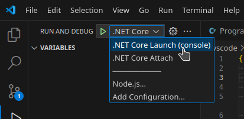

# BlackFinch Test Solution

## Overview

This solution is incomplete.

1. There is a working (but mostly unimplemented) DataStore
2. The Business Logic is implemented (in `src/Logic.cs`) & is partially tested
   by the xUnit Tests
3. 

# Running the Project

Two options are available to run aspects of this solution.

Spawn a terminal at the root of the project, if opened with VSCode the quickest
way would be with the "Ctrl+`" key combination.

### Testing BusinessLogic

This can be done by executing the xUnit Test project with either:

```bash
# Direct invocation
$ dotnet test tests/

# Or, if Make is available
$ make test
```

### Running the Console Application

Similarly to above, this can be achieved with:

```bash
# Direct invocation
$ dotnet run --project src/

# Or, if Make is available
$ make debug
```

Additionally, if using VSCode, the solution can be executed with the "run &
debug" built-in:



It can then be interacted with through the "Debug Console" window.

## Other Files

### Makefile

Other options within the makefile I use during debugging & testing to make life
a bit easier & is part of my default project boilerplate.

### starttime & endtime

These were generated with the commands:

```bash
$ date > starttime
```

and

```bash
$ date > endtime
```

I added these to highlight timeboxing development to an hour & used `starttime`
as a useful reference to ensure I didn't exceed this time allocation.

### ReadMe.md

Added some time after (see `$ git log`) to descibe the solution and document how
to run it. This was added late as I was troubleshooting being unable to push
anything to GitHub for some hours.

### .devcontainer

More boilerplate, I do all programming within DevContainers, the contents of
this folder configure the container environment

## Use of AI (Copilot)

I used GitHub Copilot to generate some of the seed data (see `src/DataStore/SeedData.cs`), but otherwise this work is my own.
